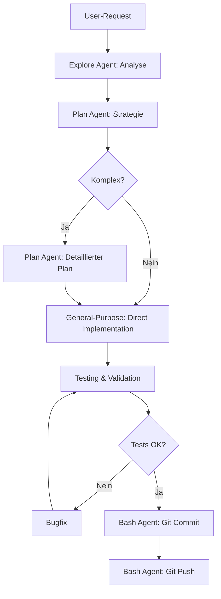
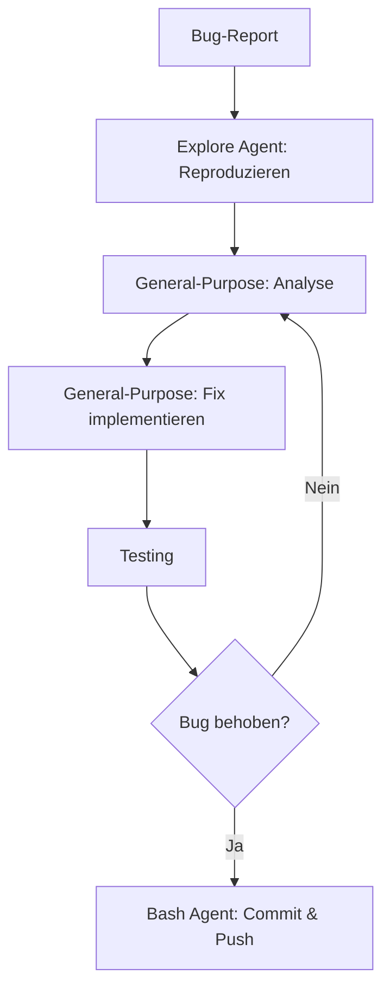
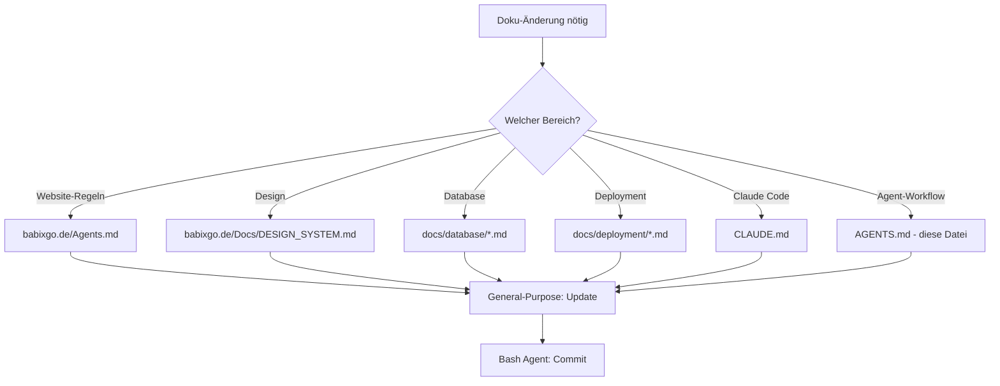

# AGENTS.md - Agent-Orchestrierung & Workflow-Protokoll

**Repository:** babixGO Monorepo
**Version:** 2.0.0
**Letzte Aktualisierung:** 2026-01-16
**Status:** Production-Ready

---

## 🎯 Zweck

Diese Datei definiert **Agent-Rollen, Verantwortlichkeiten und Workflow-Protokolle** für die Arbeit im babixGO Monorepo.

**Gilt für:**
- Claude Code CLI Agents
- GitHub Copilot
- Andere KI-Assistenten
- Automatisierungs-Scripts

**Abweichungen sind nicht erlaubt**, außer sie werden ausdrücklich dokumentiert.

---

## 🏗️ Repository-Architektur

### Monorepo-Struktur

```
/home/user/babixgo/
├── babixgo.de/                  # HAUPTPROJEKT - Monopoly GO Services Website
│   ├── Agents.md                # Website-spezifische Regeln (PRIORITÄT!)
│   ├── angebote/                # Monopoly GO Services (Hauptgeschäft)
│   ├── anleitungen/             # Tutorials (Funnel)
│   ├── files/                   # Download-Portal (Support)
│   ├── user/                    # User-Management
│   ├── admin/                   # Admin-Panel
│   ├── auth/                    # Authentifizierung
│   └── shared/                  # Shared Resources (Partials, Classes, Config)
│
├── docs/                        # Zentrale Dokumentation
│   ├── database/                # DB-Dokumentation
│   ├── deployment/              # Deployment-Guides
│   ├── project/                 # Projekt-Management
│   └── website/                 # Website-spezifische Docs
│
├── archive/                     # Archivierte Dokumentation
├── .github/                     # GitHub-Konfiguration
├── CLAUDE.md                    # Claude Code Leitfaden
├── AGENTS.md                    # Diese Datei
└── README.md                    # Projekt-Hauptdokumentation
```

---

## 👥 Agent-Rollen

### 1. **Explore Agent** (Codebase-Erkundung)

**Verantwortlichkeiten:**
- Repository-Struktur analysieren
- Dateien lokalisieren
- Code-Muster identifizieren
- Abhängigkeiten zwischen Modulen verstehen

**Verwendung:**
```plaintext
Wann: Wenn Fragen zur Codebase-Struktur gestellt werden
Beispiele:
  - "Wo wird die Session-Konfiguration definiert?"
  - "Wie funktioniert das Download-System?"
  - "Welche Dateien nutzen das Design-System?"
```

**Tools:**
- Glob (Dateien finden)
- Grep (Code durchsuchen)
- Read (Dateien lesen)

**Output:** Detaillierter Bericht über gefundene Strukturen

---

### 2. **Plan Agent** (Implementierungs-Planung)

**Verantwortlichkeiten:**
- Feature-Implementierungen planen
- Architektur-Entscheidungen treffen
- Schritt-für-Schritt-Pläne erstellen
- Kritische Dateien identifizieren

**Verwendung:**
```plaintext
Wann: Vor der Implementierung komplexer Features
Beispiele:
  - "Plane: Neues Partner-Event-Service hinzufügen"
  - "Plane: User-Dashboard mit Download-Statistiken"
  - "Plane: PWA Offline-Modus verbessern"
```

**Tools:**
- Read (bestehenden Code analysieren)
- Grep/Glob (relevante Dateien finden)
- Task (Sub-Agenten für Research spawnen)

**Output:** Detaillierter Implementierungs-Plan

---

### 3. **General-Purpose Agent** (Mehrzweck-Aufgaben)

**Verantwortlichkeiten:**
- Code-Implementierung
- Bug-Fixes
- Refactoring
- Testing

**Verwendung:**
```plaintext
Wann: Für Standard-Entwicklungsaufgaben
Beispiele:
  - "Implementiere: CSRF-Schutz für Kontaktformular"
  - "Fixe: Session-Sharing zwischen Domains"
  - "Refactor: Download-Handler vereinfachen"
```

**Tools:**
- Read, Edit, Write (Code-Änderungen)
- Bash (Git-Operationen, Tests)
- Grep/Glob (Code-Suche)

**Output:** Funktionierende Code-Änderungen

---

### 4. **Bash Agent** (Terminal-Operationen)

**Verantwortlichkeiten:**
- Git-Operationen (commit, push, branch)
- File-System-Operationen (mkdir, mv, chmod)
- Dependency-Management (wenn npm vorhanden)
- Build-Prozesse (bei Bedarf)

**Verwendung:**
```plaintext
Wann: Für Terminal-Kommandos
Beispiele:
  - Git-Commits erstellen
  - Dateien verschieben/umbenennen
  - Verzeichnisse strukturieren
```

**Tools:**
- Bash-Kommandos

**Output:** Terminal-Kommando-Ergebnisse

---

## 🔄 Workflow-Protokolle

### Workflow 1: Neue Feature-Implementierung



**Schritt-für-Schritt:**

1. **Anforderung verstehen**
   - User-Request analysieren
   - Scope definieren

2. **Codebase erkunden** (Explore Agent)
   - Relevante Dateien finden
   - Bestehende Implementierung verstehen
   - Abhängigkeiten identifizieren

3. **Implementierung planen** (Plan Agent)
   - Architektur-Entscheidungen treffen
   - Schritt-für-Schritt-Plan erstellen
   - Kritische Dateien auflisten

4. **Code implementieren** (General-Purpose Agent)
   - Plan befolgen
   - Code schreiben/ändern
   - Best Practices einhalten

5. **Testen**
   - Funktionalität testen
   - Browser-Console prüfen
   - Mobile-Ansicht testen

6. **Git-Operationen** (Bash Agent)
   - Änderungen committen
   - Zu Feature-Branch pushen

---

### Workflow 2: Bug-Fix



**Schritt-für-Schritt:**

1. **Bug reproduzieren** (Explore Agent)
   - Fehler nachstellen
   - Error Logs analysieren
   - Betroffene Dateien identifizieren

2. **Root Cause finden** (General-Purpose Agent)
   - Code analysieren
   - Debugging (Browser DevTools, PHP Logs)

3. **Fix implementieren** (General-Purpose Agent)
   - Minimal-invasive Lösung
   - Keine unnötigen Änderungen

4. **Regression-Testing**
   - Bug ist behoben?
   - Keine neuen Bugs eingeführt?

5. **Commit & Push** (Bash Agent)

---

### Workflow 3: Dokumentations-Update



**Wichtig:** Dokumentation immer aktuell halten!

---

## 🎯 Verantwortlichkeitsmatrix

| Task-Typ | Primärer Agent | Support-Agent | Tools |
|----------|----------------|---------------|-------|
| **Codebase-Exploration** | Explore | — | Glob, Grep, Read |
| **Feature-Planung** | Plan | Explore | Read, Grep, Task |
| **Code-Implementierung** | General-Purpose | Plan | Read, Edit, Write |
| **Bug-Fix** | General-Purpose | Explore | Read, Edit, Grep |
| **Refactoring** | General-Purpose | Plan | Read, Edit, Write |
| **Testing** | General-Purpose | — | Bash, Read |
| **Git-Operationen** | Bash | — | Bash |
| **File-Management** | Bash | — | Bash |
| **Dokumentation** | General-Purpose | — | Read, Edit, Write |

---

## 📋 Kommunikationsprotokolle

### Agent-zu-Agent-Kommunikation

**Format:**
```plaintext
[Agent-Typ] → [Agent-Typ]: [Nachricht]

Beispiel:
[Plan] → [General-Purpose]: "Implementiere Step 3: User-Dashboard erweitern"
[General-Purpose] → [Bash]: "Commit changes mit Message: 'feat: Add download stats to dashboard'"
```

### Agent-zu-User-Kommunikation

**Format:**
```plaintext
[Status-Update]
"Schritt X von Y abgeschlossen: [Beschreibung]"

[Frage an User]
"Unklar: Soll Feature X so oder so implementiert werden?"

[Ergebnis-Bericht]
"Fertig: [Zusammenfassung] - [Dateien geändert] - [Tests durchgeführt]"
```

### Error-Reporting

**Format:**
```plaintext
⚠️ FEHLER: [Kurzbeschreibung]

Details:
- Datei: [Pfad]
- Zeile: [Zeilennummer]
- Fehler-Typ: [z.B. Syntax Error, 500 Server Error]
- Error Message: [Original Error Message]

Nächste Schritte:
1. [Schritt 1]
2. [Schritt 2]
```

---

## 🚨 Eskalationswege

### Level 1: Automatische Lösung

**Agent versucht selbständig zu lösen:**
- Dokumentation konsultieren
- Ähnliche Code-Patterns suchen
- Best Practices anwenden

### Level 2: Agent-Kollaboration

**Agent spawned Sub-Agent:**
```plaintext
Beispiel:
- General-Purpose spawned Explore Agent
- Explore findet relevante Dateien
- General-Purpose implementiert basierend auf Findings
```

### Level 3: User-Interaktion

**Agent fragt User:**
- Unklare Requirements
- Design-Entscheidungen
- Architektur-Trade-offs

**Format:**
```plaintext
🤔 FRAGE AN USER:

Kontext: [Situation beschreiben]

Optionen:
A) [Option A] - Vorteile: [...], Nachteile: [...]
B) [Option B] - Vorteile: [...], Nachteile: [...]

Empfehlung: [A/B] weil [Begründung]

Deine Entscheidung?
```

### Level 4: Blockiert / Nicht lösbar

**Agent meldet:**
```plaintext
🛑 BLOCKIERT:

Problem: [Beschreibung]

Versuche Lösungen:
1. [Versuch 1] → [Ergebnis]
2. [Versuch 2] → [Ergebnis]

Benötige:
- [z.B. Server-Zugriff]
- [z.B. Externe API-Keys]
- [z.B. User-Entscheidung zu Architektur]
```

---

## 📐 Best Practices für Agenten

### 1. **Immer dokumentieren**

**VOR Code-Änderungen:**
- Relevante Dokumentation lesen
- `babixgo.de/Agents.md` prüfen (Website-Regeln)
- `CLAUDE.md` konsultieren (Entwickler-Guide)

**NACH Code-Änderungen:**
- Changelog aktualisieren (in `babixgo.de/Agents.md`)
- README.md aktualisieren (bei strukturellen Änderungen)
- Commit-Message klar formulieren

### 2. **Struktur respektieren**

**Website-Code** (`babixgo.de/`):
- Partials-Struktur einhalten
- Design System verwenden
- Keine Duplikate

**Plattform-Code** (Auth, User, Admin, Files):
- Shared Classes nutzen (`shared/classes/`)
- Database Singleton verwenden
- Security Best Practices

### 3. **Testing-First**

**Vor jedem Commit:**
```bash
# Browser-Console prüfen (keine Errors)
# Mobile-Ansicht testen
# Links testen (keine 404s)
# Performance-Check (PageSpeed Insights)
```

### 4. **Incremental Changes**

**Kleine, fokussierte Commits:**
```bash
✅ RICHTIG:
- "feat: Add dice boost pricing table"
- "fix: Correct session cookie domain"
- "style: Adjust button spacing on mobile"

❌ FALSCH:
- "Update everything"
- "Various fixes and improvements"
- "WIP"
```

### 5. **Error Handling**

**Graceful Degradation:**
```php
// ✅ RICHTIG - Try-Catch mit Fallback
try {
    $db = Database::getInstance();
    $data = $db->query("SELECT ...");
} catch (Exception $e) {
    error_log("DB Error: " . $e->getMessage());
    $data = []; // Fallback
}

// ❌ FALSCH - Keine Error Handling
$db = Database::getInstance();
$data = $db->query("SELECT ...");
```

---

## 🔗 Integration mit bestehenden Systemen

### Git-Workflow

**Branch-Strategie:**
```bash
# Hauptbranch
main / master

# Feature-Branches (Claude Code)
claude/<feature-description>-<session-id>

# Beispiel
claude/add-dice-boost-service-ABC123
```

**Commit-Konventionen:**
```bash
# Conventional Commits Format
<type>: <description>

# Types:
feat     # Neue Feature
fix      # Bugfix
docs     # Dokumentation
style    # CSS/Design
refactor # Code-Refactoring
perf     # Performance
test     # Testing
chore    # Maintenance
```

**Push-Requirements:**
```bash
# IMMER mit -u origin <branch-name>
git push -u origin claude/feature-ABC123

# Branch-Name-Requirements:
# - Muss mit "claude/" beginnen
# - Muss mit Session-ID enden
# - Bei 403 Fehler → Branch-Namen prüfen
```

### CI/CD Integration

**Aktuell:** ❌ Kein CI/CD

**Deployment:**
- Manuell via FTP zu Strato
- Kein Build-Prozess
- Direktes File-Upload

**Zukünftig (optional):**
- GitHub Actions für Testing
- Automated Deployment-Checks
- Lighthouse CI für Performance

### Monitoring & Logging

**Error Logs:**
```plaintext
Strato FTP:
- /error_log (Root)
- /babixgo.de/error_log
- Browser DevTools Console
```

**Analytics:**
- Google Analytics 4 (GA4)
- Facebook Pixel
- Download-Tracking (in DB)

---

## 📊 Performance-Metriken

### Agent-Performance-Ziele

| Metrik | Zielwert | Messung |
|--------|----------|---------|
| **Task Completion Rate** | >95% | Erfolgreich abgeschlossene Tasks / Gesamt |
| **Code Quality** | >90% | Keine Errors in Browser Console |
| **Documentation Accuracy** | 100% | Doku entspricht Code |
| **Test Pass Rate** | 100% | Alle Tests bestanden vor Commit |

### Website-Performance-Ziele

| Metrik | Zielwert | Tool |
|--------|----------|------|
| **PageSpeed Score (Mobile)** | >90 | Lighthouse |
| **PageSpeed Score (Desktop)** | >95 | Lighthouse |
| **Time to Interactive (TTI)** | <3s | Lighthouse |
| **First Contentful Paint (FCP)** | <1.8s | Lighthouse |

---

## 🎓 Agent-Training & Learning

### Häufige Fehler vermeiden

**1. Relative Pfade**
```php
// ❌ FALSCH
require '../partials/header.php';

// ✅ RICHTIG
require $_SERVER['DOCUMENT_ROOT'] . '/partials/header.php';
```

**2. Inline-Styles**
```html
<!-- ❌ FALSCH -->
<div style="color: red;">Text</div>

<!-- ✅ RICHTIG -->
<div class="error-text">Text</div>
```

**3. Mehrere H1**
```html
<!-- ❌ FALSCH -->
<h1>Erste Überschrift</h1>
<h1>Zweite Überschrift</h1>

<!-- ✅ RICHTIG -->
<h1>Hauptüberschrift</h1>
<h2>Unterüberschrift</h2>
```

### Lern-Ressourcen

**Dokumentation:**
1. `babixgo.de/Agents.md` - Website-Regeln (PFLICHT)
2. `CLAUDE.md` - Entwickler-Guide
3. `docs/website/TESTING_GUIDE.md` - Testing
4. `docs/deployment/DEPLOYMENT_GUIDE.md` - Deployment

**Code-Examples:**
- `/templates/` - Vorlagen für neue Seiten
- Bestehende Seiten in `/angebote/` - Best Practices

---

## 🔄 Continuous Improvement

### Feedback-Loop

**Nach jedem Task:**
1. Was lief gut?
2. Was lief schlecht?
3. Was kann verbessert werden?

**Dokumentation updaten:**
- Neue Patterns → `DESIGN_SYSTEM.md`
- Neue Regeln → `babixgo.de/Agents.md`
- Neue Workflows → `AGENTS.md` (diese Datei)

### Version-Historie

**Diese Datei:**
- v2.0.0 (2026-01-16): Initiale Version für Monorepo

**Nächste Updates:**
- Bei neuen Agent-Typen
- Bei Workflow-Änderungen
- Bei neuen Best Practices

---

## 🎯 Leitsatz für Agenten

> **Verstehe den Kontext. Respektiere die Struktur. Dokumentiere alles. Teste gründlich.**

---

**Version:** 2.0.0
**Letzte Aktualisierung:** 2026-01-16
**Nächstes Review:** Bei strukturellen Änderungen oder neuen Agent-Typen
